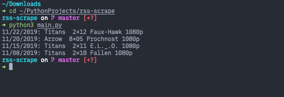

### RSS-Scrape

#### CLI Tool to get latest updates from  [showrss.info](showrss.info)
##### Know when your favourite TV show episodes aired lately

<p>I use Python3 and pip3 for development</p>

1. Register at [showrss.info](showrss.info) and follow some series
2. Add credentials to .env file (look at .env.sample)
3. Install dependencies ```$ pip3 install -r requirements.txt```
4. Run script ``` $ python3 main.py```
5. Enjoy.

#### Demo
